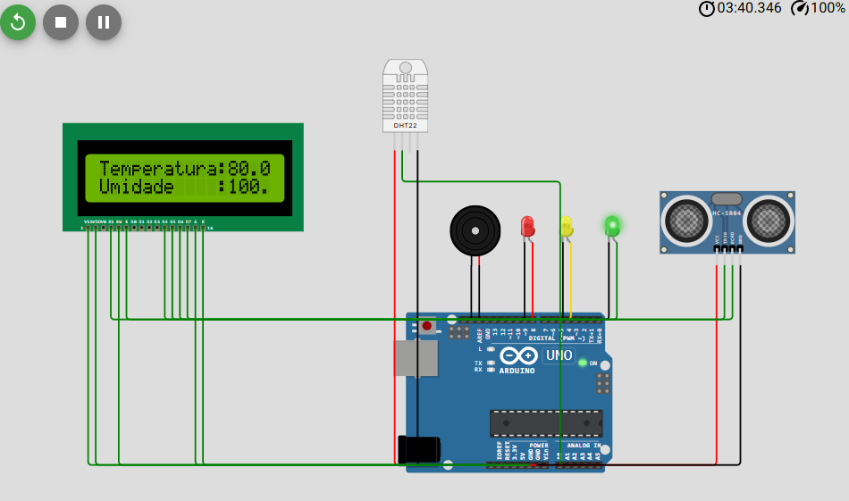
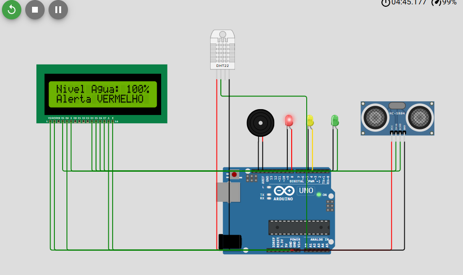
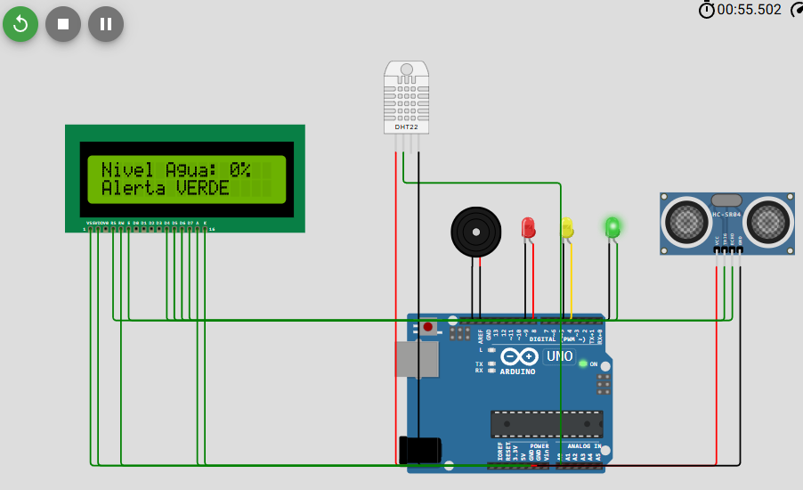

# 🌊 Detecção de Enchentes com IoT — Projeto HydroMind

Projeto desenvolvido para a **Global Solutions**, com o objetivo de monitorar em tempo real o nível da água, temperatura e umidade, permitindo a emissão de alertas preventivos contra enchentes. O sistema utiliza sensores conectados a um **Arduino Uno**, com sinalização visual (LEDs), sonora (buzzer) e exibição dos dados no **display LCD 16x2**.

## 🧰 Componentes Utilizados

- 1 Arduino Uno
- 1 Sensor Ultrassônico HC-SR04
- 1 Sensor de Temperatura e Umidade DHT22
- 3 LEDs (Verde, Amarelo e Vermelho)
- 1 Buzzer
- 1 Display LCD 16x2 com potenciômetro (ajuste de contraste)

## ⚙️ Funcionamento

O sistema faz a leitura dos seguintes parâmetros:

- **Temperatura e Umidade** — através do sensor **DHT22**.
- **Nível da Água** — medido pelo sensor **HC-SR04**, que calcula a distância da água até o sensor e converte esse valor em uma **porcentagem de ocupação do nível máximo definido**.

Com base no nível de água, o sistema ativa diferentes **níveis de alerta**, tanto visuais quanto sonoros. Todas as informações são exibidas no **display LCD** e também enviadas via **Serial Monitor** para acompanhamento no computador.

## 🔄 Lógica de Alerta

### 🌡️ Temperatura e Umidade
- São exibidas no LCD a cada ciclo de leitura.

### 🌊 Nível da Água
- O nível é convertido em uma porcentagem, onde:
  - Distância **≤ 3 cm** → **Alerta Vermelho** 🚨  
    - LED Vermelho ligado  
    - Buzzer tocando com intervalos rápidos  
    - **Perigo Imediato de Enchente**
  - Distância **> 3 cm e ≤ 10 cm** → **Alerta Amarelo** ⚠️  
    - LED Amarelo ligado  
    - Buzzer tocando com intervalos médios  
    - **Nível Crítico - Atenção**
  - Distância **> 10 cm** → **Alerta Verde** ✅  
    - LED Verde ligado  
    - Buzzer desligado  
    - **Nível Seguro**

Se houver erro na leitura do DHT, o LCD exibe a mensagem: `ERROR`.

## 🖥️ Código Fonte

O código está escrito em **C/C++ para Arduino** e utiliza as bibliotecas:

- `LiquidCrystal`
- `DHT`

> As bibliotecas devem ser instaladas previamente na **IDE Arduino** para correto funcionamento.

## 🔌 Ligações do Circuito

### 📏 Sensor Ultrassônico HC-SR04
- **VCC** → 5V  
- **GND** → GND  
- **TRIG** → Pino 9  
- **ECHO** → Pino 8  

### 🌡️ Sensor DHT22
- **VCC** → 5V  
- **GND** → GND  
- **DATA** → Pino A0  

### 💡 LEDs
- **Verde** → Pino 10  
- **Amarelo** → Pino 11  
- **Vermelho** → Pino 12  

### 🔊 Buzzer
- Positivo → Pino 13  
- Negativo → GND  

### 🖥️ LCD 16x2
- **RS** → Pino 2  
- **Enable** → Pino 3  
- **D4** → Pino 4  
- **D5** → Pino 5  
- **D6** → Pino 6  
- **D7** → Pino 7  
- **VSS** → GND  
- **VDD** → 5V  
- **VO** → Meio do potenciômetro (controle de contraste)  
- **RW** → GND  
- **Anodo (LED+)** → 5V via resistor  
- **Catodo (LED-)** → GND  

### ⚙️ Potenciômetro
- Um lado → 5V  
- Outro lado → GND  
- Meio → VO (LCD)

## 🎬 Vídeo de Apresentação

- [🔗 Ver vídeo no Google Drive](https://drive.google.com/file/d/1I5Ac_KIwfFCNyIoEpF7rTRoDsTL_wDkg/view?usp=sharing)

## 🖼️ Imagens da Simulação

## 📀 Como Testar

Monte o circuito conforme o **diagrama no Wokwi**:  
- [🔗 Abrir projeto no Wokwi](https://wokwi.com/projects/432843569869945857)

## 📕 Aprendizados

Durante o desenvolvimento do projeto, foram aplicados conceitos de:

- Leitura de sensores digitais e analógicos
- Conversão de medidas (distância → porcentagem)
- Estruturas condicionais e tomada de decisão (`if`, `else if`, `else`)
- Controle de dispositivos externos: LEDs, buzzer e LCD
- Comunicação Serial com o computador
- Criação de soluções IoT para monitoramento ambiental

## 📋 Observações

- A sensibilidade dos alertas pode ser ajustada alterando os valores de distância no código.
- O contraste do LCD deve ser regulado no potenciômetro para melhor leitura.
- Possíveis erros no sensor DHT foram tratados no código, exibindo "ERROR" no display quando necessário.

## 🚀 Desenvolvido por:

- **João Batista Lima Neto (RM: 563426)**  
- **Júlio César Augusto Vieira (RM: 563366)**
